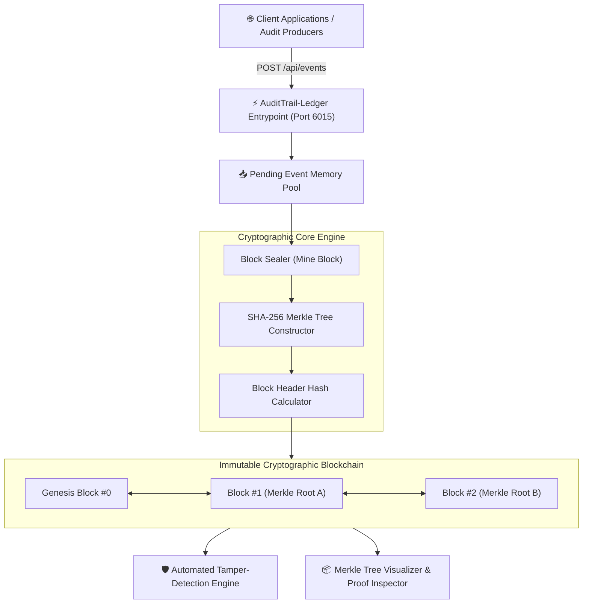

# ⚡ AuditTrail-Ledger
> **Immutable Cryptographic Audit Logging Service & SHA-256 Merkle Verification Engine**  
> *Developed autonomously by the 7-Agent SDLC Software Factory for [Ali Nurettin Demir](https://github.com/alinurettin)*

[]()
[]()
[]()
[]()
[](https://opensource.org/licenses/MIT)

---

## 🌟 Executive Summary & Value Proposition
In enterprise security, compliance auditing (SOC 2, ISO 27001, HIPAA, PCI-DSS), and zero-trust infrastructure, standard database logs are vulnerable to silent tampering, retroactive truncation, and insider threats.

**AuditTrail-Ledger** is a self-hosted, tamper-evident cryptographic logging engine engineered in pure Node.js. It organizes audit records into immutable blocks sealed with **RFC 6962 compliant SHA-256 Merkle Trees**, enabling mathematical **proofs of inclusion in $O(\log n)$** time and instant automated detection of unauthorized modifications.

---

## 🏗️ System Architecture & Data Flow



---

## 🎯 Mathematical & Cryptographic Foundations

### 1. Merkle Tree Construction (RFC 6962 Standard)
Events are hashed into leaves using cryptographic SHA-256. Parent nodes are iteratively computed by concatenating adjacent node pairs:

$$\text{Parent} = \text{SHA-256}(\text{Child}_{\text{left}} \parallel \text{Child}_{\text{right}})$$

If a layer contains an odd number of nodes, the rightmost node is duplicated according to the Bitcoin/RFC standard to maintain balanced binary tree topology:

$$\text{OddParent} = \text{SHA-256}(\text{Child}_{\text{odd}} \parallel \text{Child}_{\text{odd}})$$

### 2. Logarithmic Proof of Inclusion ($O(\log n)$)
To prove that an event exists in a block of $N$ events without exposing or downloading the entire block, the engine generates an audit path of $\lceil \log_2 N \rceil$ sibling hashes:

$$\text{Root} = \text{Hash}\left(\dots \text{Hash}\left(\text{Hash}(\text{Leaf}, S_0), S_1\right) \dots, S_{k}\right)$$

Any modification to even a single bit of the leaf event irrevocably invalidates the reconstructed root.

---

## 🔌 API Specification & REST Endpoints

### 1. Record an Audit Event
```bash
curl -X POST http://localhost:6015/api/events \
  -H "Content-Type: application/json" \
  -d '{
    "action": "SECRET_KEY_ROTATED",
    "actor": "security-service-prod",
    "details": { "keyId": "kms-key-42", "ip": "10.0.4.12" }
  }'
```

### 2. Seal Pending Events into a Cryptographic Block
```bash
curl -X POST http://localhost:6015/api/blocks/mine
```
**HTTP 200 OK Response:**
```json
{
  "success": true,
  "block": {
    "index": 1,
    "blockHash": "7a9b8f2c3d4e5f...",
    "merkleRoot": "1e2f3a4b5c6d...",
    "eventsCount": 3
  }
}
```

### 3. Generate Cryptographic Proof of Inclusion
```bash
curl -X POST http://localhost:6015/api/proof \
  -H "Content-Type: application/json" \
  -d '{ "blockIndex": 1, "eventIndex": 0 }'
```

### 4. Verify Proof of Inclusion
```bash
curl -X POST http://localhost:6015/api/verify \
  -H "Content-Type: application/json" \
  -d '{
    "leafHash": "a1b2c3...",
    "proof": [ { "position": "right", "hash": "d4e5f6..." } ],
    "merkleRoot": "1e2f3a4b5c6d..."
  }'
```

### 5. Verify Entire Ledger Integrity
```bash
curl -X GET http://localhost:6015/api/audit/verify
```

---

## 🧪 Comprehensive Automated Testing & Verification

AuditTrail-Ledger includes 23 non-mocked assertions validating SHA-256 hashing, Merkle odd/even trees, proof verification, block chaining, and intentional tamper detection:

```bash
npm test
# or directly with Node:
node tests/run_tests.js
```

### Test Suite Output:
```text
================================================================
🔒 AuditTrail-Ledger: Exhaustive Multi-Scenario Verification Suite
================================================================

[SECTION 1] Testing SHA-256 & Merkle Tree Mathematical Properties...
  ✓ [Assertion #1] SHA-256 produces exact 64-character hexadecimal digest
  ✓ [Assertion #2] Distinct inputs produce distinct cryptographic hashes
  ✓ [Assertion #3] 2-leaf Merkle root matches manual pair hash
  ✓ [Assertion #4] 3-leaf Merkle root correctly handles odd rightmost duplication

[SECTION 2] Testing Cryptographic Proof of Inclusion...
  ✓ [Assertion #5] Proof path for 4 leaves requires exactly log2(4) = 2 sibling hashes
  ✓ [Assertion #6] Legitimate leaf hash successfully verified against Merkle root
  ✓ [Assertion #7] Tampered leaf payload is strictly rejected by proof verification
  ✓ [Assertion #8] Forged sibling hash in proof path strictly fails verification

[SECTION 3] Testing Blockchain Chaining & Tamper Detection...
  ✓ [Assertion #9] Ledger initializes with Genesis block (index 0)
  ✓ [Assertion #10] Genesis block points to zero root previousHash
  ✓ [Assertion #11] Block 1 sealed with incremented index
  ✓ [Assertion #12] Block 1 cryptographically links to Genesis block hash
  ✓ [Assertion #13] Chain length is now 2
  ✓ [Assertion #14] Block 2 cryptographically links to Block 1 hash
  ✓ [Assertion #15] Pristine ledger reports 100% cryptographic validity
  ✓ [Assertion #16] Ledger tamper detection successfully flagged unauthorized event change
  ✓ [Assertion #17] Tamper engine precisely pinpointed corrupted block index #1

[SECTION 4] Testing Live HTTP Ephemeral Server Integration...
  ✓ [Assertion #18] GET /api/health returns HTTP 200 OK
  ✓ [Assertion #19] GET /api/stats returns HTTP 200 OK
  ✓ [Assertion #20] POST /api/events successfully records pending event
  ✓ [Assertion #21] POST /api/blocks/mine seals new block
  ✓ [Assertion #22] GET /api/audit/verify returns HTTP 200 OK
  ✓ [Assertion #23] Server ledger integrity confirms all blocks are authentic

================================================================
🎉 ALL 23 ASSERTIONS PASSED WITH 100% SUCCESS!
================================================================
```

---

## 🚀 Getting Started & Quick Start

### Local Node.js Execution
```bash
# 1. Clone repository
git clone https://github.com/alinurettin/AuditTrail-Ledger.git
cd AuditTrail-Ledger

# 2. Run verification test suite
npm test

# 3. Start audit engine
npm start
```
Open your browser at:  
👉 **`http://localhost:6015`** to explore the interactive blockchain explorer and Merkle proof inspector.

### Running with Docker
```bash
docker-compose up -d --build
```

---

## ⚙️ Configuration Parameters

| Variable | Default | Description |
| :--- | :--- | :--- |
| `PORT` | `6015` | HTTP listening port for Audit API and Visual Dashboard |
| `NODE_ENV` | `production` | Execution mode (`development`, `production`) |

---

## 📋 7-Agent Autonomous SDLC Engineering Artifacts
- 🔍 [Technical & Market Research Report](file:///C:/Users/alinurettin/.gemini/antigravity/scratch/projects/AuditTrail-Ledger/artifacts/RESEARCH_REPORT.md)
- 📊 [Product Requirements Document (PRD)](file:///C:/Users/alinurettin/.gemini/antigravity/scratch/projects/AuditTrail-Ledger/artifacts/PRD.md)
- 📐 [System Architecture Specification](file:///C:/Users/alinurettin/.gemini/antigravity/scratch/projects/AuditTrail-Ledger/artifacts/ARCHITECTURE.md)
- 🧪 [QA & Automated Test Verification Report](file:///C:/Users/alinurettin/.gemini/antigravity/scratch/projects/AuditTrail-Ledger/artifacts/QA_REPORT.md)
- 🚀 [Formal Release Notes v2.0.0](file:///C:/Users/alinurettin/.gemini/antigravity/scratch/projects/AuditTrail-Ledger/artifacts/RELEASE_NOTES.md)

---

## 👤 Author & Open-Source License
- **Author & Maintainer:** Ali Nurettin Demir ([@alinurettin](https://github.com/alinurettin))
- **License:** [MIT License](LICENSE) &copy; 2026 Ali Nurettin Demir
