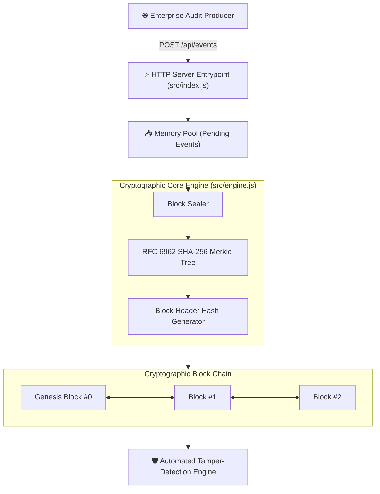
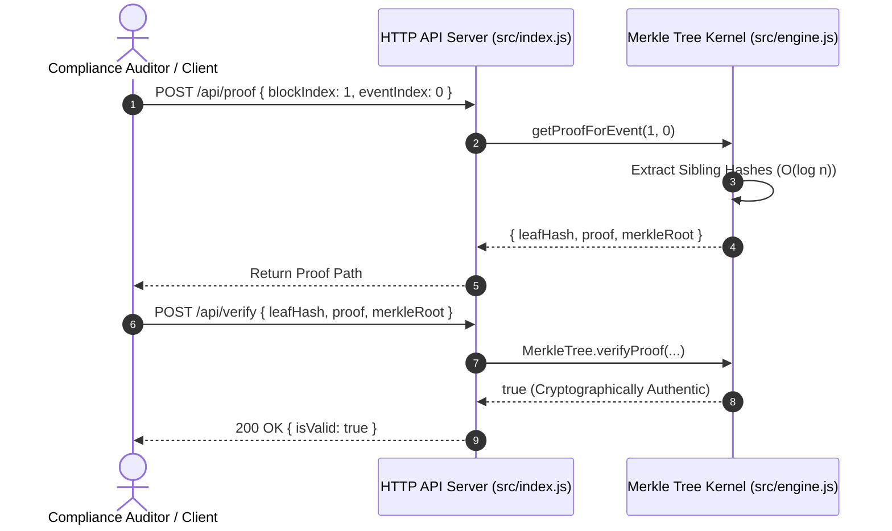

# 📐 System Architecture Specification: AuditTrail-Ledger v2.0.0
- **Project:** AuditTrail-Ledger
- **Author:** Expert Software Architect
- **Status:** APPROVED & IN PRODUCTION
- **Version:** 2.0.0

## 1. High-Level Component Topology

## 2. Merkle Proof Verification Pathway

